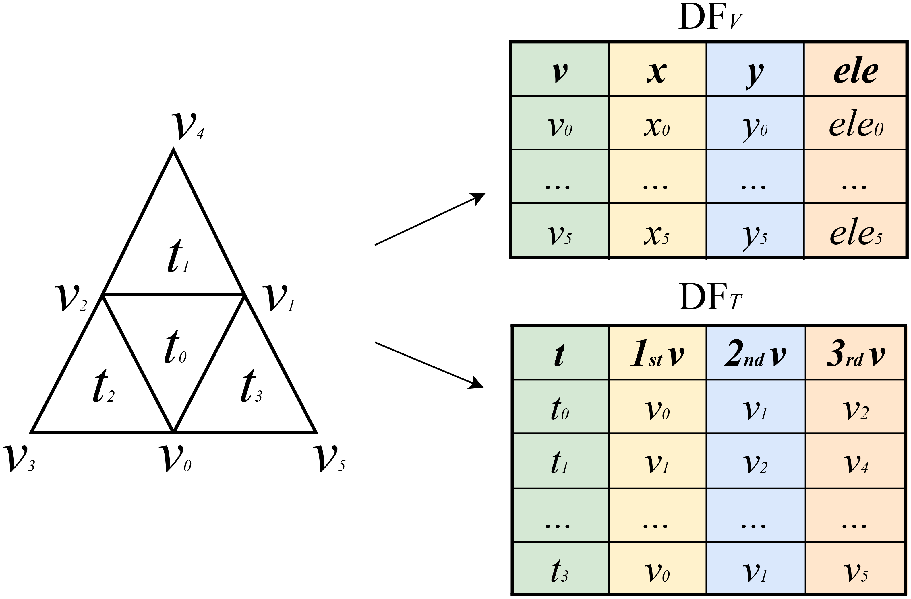

# Morse_Spark framework

## Introduction
Terrain topology plays an important role in simulations and segmentation. A widely used terrain representation is the Triangulated Irregular Network (TIN). However, topological analysis on TINs is challenging due to high time and memory requirements, which limit the size of the terrain that can be analyzed.

We address this problem by introducing a novel framework for efficient and scalable analysis of large TINs based on Morse theory using Apache Spark. The proposed framework, named Morse-Spark, is based on a novel data structure for encoding the minimal information of a TIN, and integrates efficient algorithms for computing terrain morphology. To evaluate the effectiveness and scalability of such a framework, we compare Morse-Spark against a vanilla Spark implementation and three well-established software libraries for the topological analysis of TINs through a comprehensive set of experiments. Our experimental evaluation with real-world TINs shows that Morse-Spark can effectively handle datasets at least 20 times larger than existing approaches.

## Mesh encoding
Morse-Spark encodes two DataFrames, called $DF_V$ and $DF_T$.




## Connectivity relations extraction
Morse-Spark supports two strategies for extracting connectivity relations: *global* methods and *local* methods. Global methods work on an entire DataFrame by using native operations provided in Spark. *Local methods* offer a more efficient approach by applying *user-defined functions (UDFs)* to a DataFrame.

+ Boundary relation
  * TV relation
  * TE relation
  * EV relation
+ Coboundary relation
  * VT relation  
  * VE relation
  * ET relation
+ Adjacent relation
  * VV relation
  * EE relation
  * TT relation
 
## Topological features computation
Morse-Spark supports the computation of Forman gradient and Morse manifolds:
+ Forman gradient
+ descending 2-manifolds (influence regions of maxima)
+ ascending 2-manifolds (influence regions of minima)
+ descending 1-manifolds (Separatrix $V_1$-paths)
+ ascending 1-manifolds (Separatrix $V_2$-paths)

### Supported File Formats ###

Morse-Spark supports files in `.off` format, which are simple ASCII files containing the explicit representation of vertices and triangles
```
nV mT 0            -  number of vertices (nV) and triangles (mT)
x1 y1 f1           -  x y z coordinates for each vertex and its field value
x2 y2 f2
.  .  .
xn yn fn

v11 v21 v31        -  vertices (v11 v21 v31) of the first triangle
v12 v22 v32
.   .   .  
v1m v2m v3m

